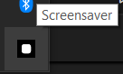
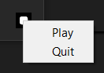

# Screensaver

A **Python project** that implements a custom screensaver for Windows.  
The screensaver moves the mouse cursor around the screen with bouncing logic, shows a black fullscreen window, and is controlled via a **system tray icon**.

---

## Features

- 🖥️ Black fullscreen background
- 🖱️ Mouse cursor animation with bounce effect
- ⌨️ Exit screensaver on user activity (mouse/keyboard)
- 📌 System tray icon:
  - Start the screensaver manually
  - Quit the application

---

## Installation

### 1. Install dependencies
```pip install -r requirements.txt```

### 2. Run the application
```python main.py```

The app will minimize to the tray after launch.


# Usage

- ▶ Start screensaver — via tray icon → "Start / Play"
- ❌ Quit app — via tray icon → "Quit"
- 🙈 Any keyboard or mouse activity hides the screensaver window.


System requirements
- Windows (uses WinAPI calls via ctypes)
- Python 3.8+


## 🚀 Installation & Usage
👉 [Download Screensaver.exe](https://github.com/IvanAfanasiev/screensaver/releases/latest)

## 📷 Preview


